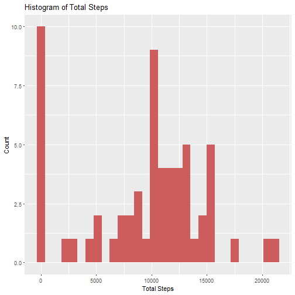
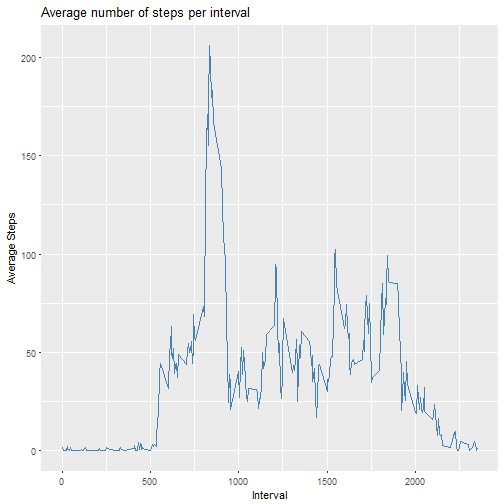
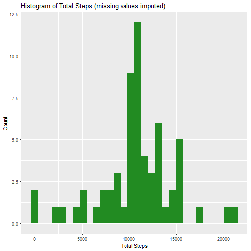
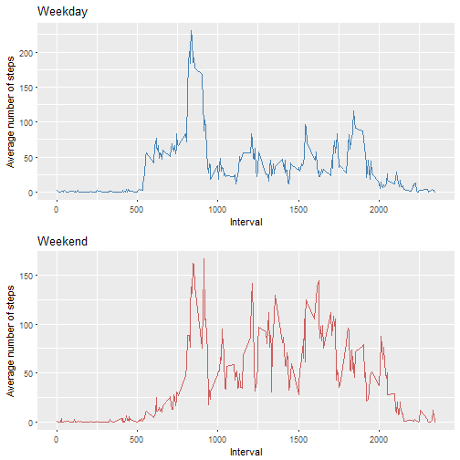

Reproducible Research Programming Assignment 1
===============================================
#####Ishan Sharma
#####01-09-2018


## Introduction
The following document includes the data analysis of the dataset containing  information about the activity of a person for about a period of 2 months. The ggplot package is mostly used for plotting graphs. The dataset has namely 3 variables recorded - 

 1. steps (indicating the number of steps for the given time date and interval)
 2. date 
 3. interval (time period at which the measutments are recorded)
 
In this dataset the data is recorded at an interval of every 5 minutes.


##Data Analysis
###Switching the warnings off globally.

```r
knitr::opts_chunk$set(warning=FALSE)
```

###Loading and processing the dataset.
 * First we begin by loading the required packages and the dataset into the R environment.
 * Further, let us take a quick look at the dataset.

```r
library(tidyverse)
library(lubridate)
library(gridExtra)
acti <- read.csv("activity.csv")
str(acti)
```

```
## 'data.frame':	17568 obs. of  3 variables:
##  $ steps   : int  NA NA NA NA NA NA NA NA NA NA ...
##  $ date    : Factor w/ 61 levels "2012-10-01","2012-10-02",..: 1 1 1 1 1 1 1 1 1 1 ...
##  $ interval: int  0 5 10 15 20 25 30 35 40 45 ...
```

 * The only processing required here is to change the class of the 'date' variable.

```r
acti$date <- ymd(acti$date)
```

###1. Histogram of the total number of steps taken each day.

```r
acti %>% group_by(date) %>% summarise(total = sum(steps, na.rm = TRUE)) %>% ggplot(mapping = aes(x = total))   + geom_histogram(stat = "bin", fill = "indianred") + labs(title = "Histogram of Total Steps", x = "Total Steps",y = "Count" )
```

```
## `stat_bin()` using `bins = 30`. Pick better value with `binwidth`.
```



 * The mean of the number of steps taken per day.

```r
t <- acti %>% group_by(date) %>% summarise(totalsteps = sum(steps, na.rm = TRUE))
mean(t$totalsteps)
```

```
## [1] 9354.23
```

 * Median of the number of steps taken per day.

```r
median(t$totalsteps)
```

```
## [1] 10395
```

###2. Time series plot of the average number of steps taken.

```r
intersteps <- acti %>% group_by(interval) %>% summarise(avg = mean(steps, na.rm = TRUE))
intersteps %>% ggplot() + geom_line(aes(x = interval, y = avg), color = "steelblue") + labs(title = "Average number of steps per interval", x="Interval", y = "Average Steps")
```



 * The 5-minute interval that, on average, contains the maximum number of steps.

```r
intersteps[intersteps$avg==max(intersteps$avg), 1]
```

```
## # A tibble: 1 x 1
##   interval
##      <int>
## 1      835
```

###3. Strategy for imputing the missing data.
* First lets take a look at the number of missing values we have.

```r
sum(!complete.cases(acti))
```

```
## [1] 2304
```

 * Now we will proceed by replacing the missing values of the steps taken with the average value of steps within that time interval. This stratergy seems more accurate then imputing the values with the average number of steps oer day because there is more variation in the steps per dat. Therefore if we consider a smaller time interval it is more likely that it will be consistant with the known data.

 * The following code does the same by  imputing the missing values in a new dataset.

```r
completeacti <- acti
for (i in 1:nrow(completeacti)){
        if(is.na(completeacti[i,1])==TRUE){
                tinterval <- completeacti[i,3]
                completeacti[i,1] <- intersteps[intersteps$interval==tinterval, 2]
        }
}
```

###4. Histogram of the total number of steps taken each day after missing values are imputed.

```r
completeacti %>% group_by(date) %>% summarise(total = sum(steps, na.rm = TRUE)) %>% ggplot(mapping = aes(x = total))   + geom_histogram(stat = "bin", fill = "forestgreen") + labs(title = "Histogram of Total Steps (missing values imputed)", x = "Total Steps",y = "Count" )
```

```
## `stat_bin()` using `bins = 30`. Pick better value with `binwidth`.
```



 * The major change noticeable is that of the number of datapoints with total steps  = 0 has reduced quite significantly. This change occured because of the imputation of missing values.

 * The new mean amd median after imputing the missing values are as follows -

```r
t1 <- completeacti %>% group_by(date) %>% summarise(totalsteps = sum(steps, na.rm = TRUE))
mean(t1$totalsteps)
```

```
## [1] 10766.19
```

```r
median(t1$totalsteps)
```

```
## [1] 10766.19
```

###5. Differences in activity patterns between weekdays and weekends.
 * First a new variable 'daytype' is  created having two levels 'weekday' and 'weekend'. 

```r
completeacti$daytype <- tapply(weekdays(completeacti$date), 1:nrow(completeacti), FUN = function(day){
        
        if(day=="Saturday" | day=="Sunday"){
                return("weekend")
        }
        else{
                return("weekday")
        }
})
```

 * Next the plots are made for variations of steps in weekdays and weekends.

```r
weekdayAvgSteps <- completeacti %>% filter(daytype == "weekday") %>% group_by(interval) %>% summarise(avg = mean(steps, na.rm = TRUE))
weekendAvgSteps <- completeacti %>% filter(daytype == "weekend") %>% group_by(interval) %>% summarise(avg = mean(steps, na.rm = TRUE))
p1 <- ggplot(data = weekdayAvgSteps) + geom_line(aes(x = interval, y = avg), color  = "steelblue") + labs(title = "Weekday", x = "Interval", y = "Average number of steps")
p2 <- ggplot(data = weekendAvgSteps) + geom_line(aes(x = interval, y = avg), color  = "indianred") + labs(title = "Weekend", x = "Interval", y = "Average number of steps")
grid.arrange(p1,p2, ncol = 1)
```



* From the above graph we can infer that the man definitely walks more on the weekends.

